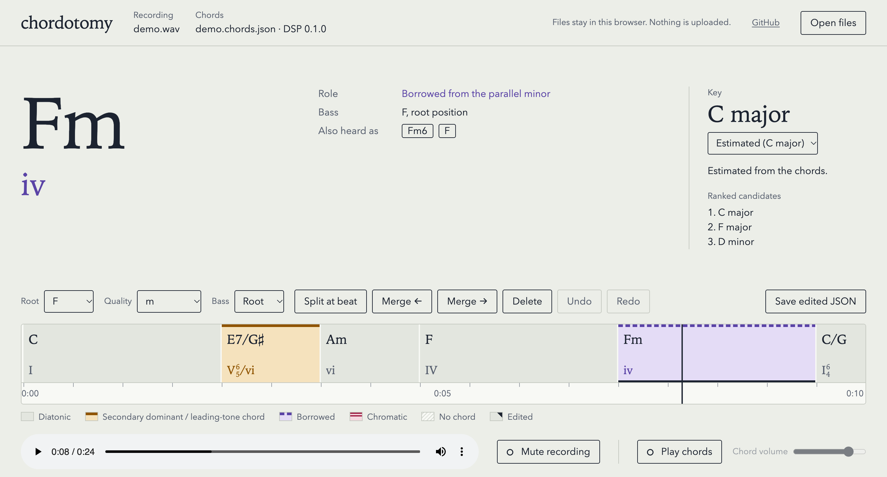

# chordotomy

[](LICENSE)

[](https://zeikar.dev/chordotomy/)

Dissect a song's harmony. Give it a recording and it finds the chords on the beat, labels them with Roman numerals, and points out the moves worth noticing (the secondary dominant, the borrowed chord). In Claude Code, a skill adds a short note on why each one works.

It analyzes; it doesn't transcribe. There is no staff notation, on purpose.

Yes, chordotomy is also a spinal surgery. This one cuts chords.

Everything runs locally. Your audio never leaves your machine.



*The viewer on a synthesized progression in C major, analyzed with `--engine dsp`. The current chord is a borrowed Fm (`iv`); earlier, E7/G♯ is the secondary dominant of Am (`V⁶₅/vi`).*

## What it does

- **Chords on the beat.** Major, minor, dominant 7th, major 7th, minor 7th, half-diminished 7th, diminished 7th, sus4, 7sus4, augmented, diminished triad, sus2 and minor 6th, with `N` for no chord. The model calls all of them but minor 6th; the DSP all but sus2 and 7sus4.
- **Two engines.** The lv-chordia model (Jiang, Chen, Li and Xia, ISMIR 2019) when its optional extra is installed, chordotomy's DSP front end otherwise. Both run on the same beat grid and the same harmonic analysis.
- **Key and Roman numerals.** Secondary dominants, secondary leading-tone chords and borrowed chords are labeled and highlighted; the viewer adds figured bass for inversions.
- **The bass note and inversion** of every chord, so slash chords (C/E, D/F♯) come out as such. A weak bass outside the chord is shown at root position instead of as a doubtful slash chord.
- **A viewer** that plays the recording with its chords, plays the chords themselves to check them by ear, and lets you correct and enter chords.
- **Explanations in Claude Code** of the highlighted moves, through the `explain-harmony` skill.

## Quick start

Requires [uv](https://docs.astral.sh/uv/).

```sh
git clone https://github.com/zeikar/chordotomy && cd chordotomy
uv sync --extra model                  # adds lv-chordia and torch, about 630 MB
uv run chordotomy analyze song.mp3     # writes song.chords.json
```

Plain `uv sync` installs the DSP engine only. [The model engine](#the-model-engine-optional) has its size, speed and training data. Then open the [viewer](https://zeikar.dev/chordotomy/) and drop `song.mp3` and `song.chords.json` on the page.

## Usage

```sh
uv run chordotomy analyze song.mp3                 # writes song.chords.json
uv run chordotomy analyze song.mp3 -o out.json
uv run chordotomy analyze song.mp3 --key A:min     # analyze in A minor instead of the estimated key
uv run chordotomy analyze song.mp3 --engine dsp    # the DSP front end, even with the model installed
```

`--key` takes `<root>:maj` or `<root>:min`, flats accepted; the JSON still lists the estimator's ranked candidates.

`--engine` picks the chord recognizer: `auto`, the default, takes the lv-chordia model when it is installed and the DSP front end otherwise; `model` and `dsp` force one. A missing or broken model install is an error that names the fix; it never falls back to the DSP silently. The JSON records which engine heard the chords.

`analyze` refuses to overwrite an existing output unless you pass `--force`. An input with no detectable beats is reported as an error, not written as an empty timeline.

### The output

`song.chords.json` (schema 8) lists every beat, the estimated key, and the chord segments. One segment of the screenshot's timeline:

```json
{
  "start_beat": 4,
  "end_beat": 6,
  "start_time": 2.438,
  "end_time": 3.646,
  "chord": "E:7",
  "candidates": ["E:7", "G#:dim", "E:maj"],
  "bass": "G#",
  "inversion": "first",
  "numeral": "V7/vi",
  "role": "secondary_dominant",
  "function": null,
  "target": "vi",
  "edited": false
}
```

Chords are Harte labels. `candidates` is the recognizer's own ranking, never a percentage. `numeral` is always root position; the viewer combines it with `inversion`, so this segment shows as V⁶₅/vi. The full format is in [docs/ARCHITECTURE.md](docs/ARCHITECTURE.md#the-chord-timeline-json).

### The model engine (optional)

```sh
uv sync --extra model
```

This adds lv-chordia and torch. On macOS the environment grows by about 630 MB, 542 MB of it torch. On an Apple M4 the model engine takes 6.3 to 6.8 s per minute of audio and peaks at 2.36 GB of RAM on a 3-minute song and 3.17 GB on a 6-minute one, against the DSP's 3.1 to 3.3 s per minute and 1.00 and 1.77 GB. The weights, five files of about 5.7 MB each, come inside the lv-chordia wheel, so nothing is downloaded at run time. The model runs on the CPU even when torch sees a GPU, and it reads the audio chordotomy has already decoded, so your audio stays on your machine.

On Linux, uv takes torch from the PyTorch CPU index, as `pyproject.toml` sets it up, rather than PyPI's build with CUDA. With pip, add `--extra-index-url https://download.pytorch.org/whl/cpu` to the install command. Python 3.13 dropped the `audioop` module that pydub, one of lv-chordia's dependencies, needs; the extra includes `audioop-lts` in its place.

lv-chordia on PyPI is Open MIR Lab's packaging of the authors' original code and weights, which it ships unchanged. The weights are MIT, like the code. lv-chordia's authors trained them on 1217 songs from Isophonics, Billboard, RWC-Pop and USPOP, public chord annotations over commercial recordings. If you would rather not use a model trained that way, leave the extra out, and the DSP front end recognizes the chords.

## Accuracy

`chordotomy evaluate` scores both engines on two public datasets with mir_eval, weighted by duration. `root` asks for the right root, `majmin` for the right major or minor triad, and `sevenths` for the right seventh chord too. For comparison, other open-source chord recognizers on the same audio and the same scoring, each run with its own inference code:

| | Tiny AAM root | majmin | sevenths | GuitarSet root | majmin | sevenths |
|---|---|---|---|---|---|---|
| **chordotomy, model engine** | 0.939 | 0.934 | 0.898 | 0.827 | 0.872 | 0.819 |
| lv-chordia, its own output | 0.951 | 0.947 | 0.911 | 0.846 | 0.893 | 0.839 |
| BTC (Park et al., 2019) | 0.931 | 0.920 | 0.880 | 0.809 | 0.864 | 0.775 |
| ChordMini BTC (Phan et al., 2026) | 0.921 | 0.908 | 0.844 | 0.818 | 0.869 | 0.798 |
| ChordMini 2E1D (Phan et al., 2026) | 0.924 | 0.913 | 0.836 | 0.742 | 0.801 | 0.746 |
| crema (McFee and Bello, 2017) | 0.898 | 0.893 | 0.794 | 0.816 | 0.873 | 0.785 |
| **chordotomy, DSP front end** | 0.842 | 0.803 | 0.768 | 0.722 | 0.696 | 0.583 |

Tiny AAM is 20 mixed tracks annotated in major and minor; GuitarSet is 180 solo-guitar accompaniment takes. Neither is in the published training data of lv-chordia, BTC or crema; ChordMini's labeled training data is not published. chordotomy's model engine is lv-chordia's chords snapped to the beat, where its harmony and its viewer work, and the snap costs 1 to 2 points against lv-chordia's frame-level output. Each metric scores only the reference chords it can compare (`majmin` leaves out sus, augmented and diminished chords), which is how GuitarSet's `majmin` can sit above its `root`. A bass outside the chord is scored as an added tone, so it can cost `majmin` and `sevenths` too. These are numbers for development, not a benchmark claim; [docs/ARCHITECTURE.md](docs/ARCHITECTURE.md#other-chord-recognizers) has the versions and settings, and [its Evaluation section](docs/ARCHITECTURE.md#evaluation) every column.

## Viewer

The viewer plays a recording along with its chord timeline. It shows the current chord, its Roman numeral with figured bass, its role and bass note, and the other chords the analyzer heard, ranked. Chords are colored by role, so secondary dominants and borrowed chords stand out. Every beat gets the same width, so a chord's width is its length in beats; where the beats come faster or slower, the seconds on the ruler bunch up or spread out instead. The header names the engine that heard the chords (lv-chordia or the DSP).

Open it at <https://zeikar.dev/chordotomy/>, or open `viewer/index.html` from a checkout. Drop the recording and its `.chords.json` on the page, or pick them with **Open files**. The files stay in your browser. The page reads them locally and makes no network requests.

To check the chords by ear, turn on **Play chords**. The page plays each detected chord on every beat, with its bass note, under the recording. **Mute recording** leaves the chords on their own. The sound is synthesized in the browser.

Space plays and pauses. → goes to the next chord. ← goes back to the start of the current chord, or to the chord before when it is already within a second of the start, so pressing it twice steps back. C turns the chords on and off, M mutes the recording, and clicking a chord jumps to it.

### Editing

The editor acts on the current chord. While you pick, it stays on that chord, even if playback moves on. **Root**, **Quality** and **Bass** set the chord and its bass note, and a pick applies at once. The chords the analyzer also heard are buttons: one click makes one of them the chord. **Split at beat** cuts the chord at the beat under the playhead. **Merge ←** and **Merge →** join it with the chord before or after, keeping its own chord and bass. **Delete** removes it, and a neighbour takes its beats. **Undo** and **Redo** step through the edits. The select under **Key** fixes the key, and **Estimated** goes back to the estimate. After every edit the page works out the key, numerals and roles again, as `chordotomy analyze` does, and marks the chords you changed.

Chords start and end on the analyzer's beats. To enter a chord it missed, split where the chord starts and pick it; over silence, one pick enters a chord. There is no entering a progression from scratch: the beat grid comes from `chordotomy analyze`, so a timeline needs a recording's analysis first.

**Save edited JSON** downloads the timeline with your edits, named after the recording it came from: `song.mp3`'s `song.chords.json` saves as `song.edited.chords.json`, wherever your browser puts downloads. The opened file is never changed. Put the saved file next to the recording, and the `explain-harmony` skill reads it in place of the analyzer's. Until you save, the page shows **Unsaved edits** and asks before it closes or opens another timeline.

S splits at the beat under the playhead, and Shift+← and Shift+→ step back or forward a beat to get there. Delete or Backspace deletes the chord. Ctrl+Z (⌘Z on a Mac) undoes, and Ctrl+Shift+Z (⌘⇧Z) or Ctrl+Y redoes. Held down, these keys act once. While a select has focus, keys go to it, not to the shortcuts.

## Explanations in Claude Code

The repo is also a Claude Code plugin with one skill, `explain-harmony`. Install it once:

```text
/plugin marketplace add zeikar/chordotomy
/plugin install chordotomy@chordotomy
```

Then ask something like "explain the harmony of song.mp3". The skill runs `chordotomy analyze` locally with the plugin's own copy (it needs uv), reads the JSON, and explains the secondary dominants, borrowed chords, and bass lines. The audio stays on your machine; Claude reads only the chord timeline.

Working in this repo, `.claude/settings.json` registers the checkout itself as a directory marketplace and enables the plugin, so the skill runs from the working tree. The first session asks you to trust it; `claude plugin marketplace add .` does the same by hand.

## What it won't do

- **Staff notation.** It doesn't produce MusicXML and doesn't work out note-level rhythm.
- **Melody transcription.** It doesn't produce melody → MIDI.
- **Song sections.** It doesn't label intro, verse, or chorus.

It stops at the chords and what they're doing. [docs/ARCHITECTURE.md](docs/ARCHITECTURE.md#design-decisions) explains why.

## Roadmap

Everything on the original roadmap works: chords on the beat, the optional model engine, Roman-numeral analysis with highlights, slash chords and inversions, the Claude Code skill, and the viewer with playback, editing and manual entry. Known gaps, none scheduled:

- Some slash chords still come out in root position: in one chart check, a C♯7/E♯ read as C♯7 under both engines.
- The DSP engine does not call sus2 or 7sus4; they come from the model engine or a manual edit.
- A chart may name a different chord over the same bass (D/A where the analyzer hears Bm/A); the bass is right, the chord is the recognizer's call.

## Development

```sh
uv sync --extra dev
uv run chordotomy --version
uv run pytest
uv run ruff check . && uv run ruff format --check .
node --test viewer/tests/
```

The model tests need the extra and skip without it; the rest of the suite runs the DSP either way. `uv sync` installs exactly the extras it is given, so name every one you want, as in `uv sync --extra dev --extra model`.

The viewer is plain HTML, CSS, and JavaScript with no build step. Its tests need Node and no packages.

The viewer re-analyzes edited chords with a JavaScript port of the Python harmonic analysis, and `tests/harmony_vectors.json` pins the port to it. After changing the analysis in Python, regenerate that file; pytest fails until you do:

```sh
uv run python tests/harmony_vectors.py
```

[docs/ARCHITECTURE.md](docs/ARCHITECTURE.md) has the pipeline, the JSON format, and the design decisions with their reasons.

### Real-audio evaluation (opt-in)

`uv sync --extra dev --extra eval` adds mir_eval and pooch, which also enables the evaluation tests (skipped without it). Then:

```sh
uv run chordotomy evaluate tiny-aam [--limit N]
uv run chordotomy evaluate guitarset [--limit N]
```

Tiny AAM downloads 168 MB. GuitarSet downloads 39 MB of annotations plus 657 MB of audio, of which only the accompaniment takes being scored are extracted. `--engine` works as for `analyze`, so with the model installed the scores are the model's unless you pass `--engine dsp`. Both datasets are CC BY 4.0. In a checkout they land in `datasets/`, which is gitignored; delete it to re-download. The default test run never touches the network. Besides the chord scores, the table scores the beat grid against the annotated beats, and the `N` calls against the reference's `N`, and the bass with four more columns (`bass_ref`, `inv_prec`, `inv_rec` and `nonchord`); [docs/ARCHITECTURE.md](docs/ARCHITECTURE.md#evaluation) explains each column. The scores are numbers for development only.

## Acknowledgements

- The model engine is the work of Junyan Jiang, Ke Chen, Wei Li and Gus Xia, ["Large-Vocabulary Chord Transcription via Chord Structure Decomposition"](https://archives.ismir.net/ismir2019/paper/000078.pdf), ISMIR 2019, with its [original code and weights](https://github.com/music-x-lab/ISMIR2019-Large-Vocabulary-Chord-Recognition) (MIT), as packaged for PyPI by [Open MIR Lab](https://github.com/openmirlab/lv-chordia) (`lv-chordia`, MIT).
- [librosa](https://librosa.org/) for the audio front end and beat tracking, and [mir_eval](https://github.com/mir-evaluation/mir_eval) for scoring.
- The DSP front end's chroma whitening follows Matthias Mauch and Simon Dixon's 2010 chord recognition paper, implemented from the paper.
- Evaluation data: [Tiny AAM](https://zenodo.org/records/6771120) and [GuitarSet](https://zenodo.org/records/3371780), both CC BY 4.0.

## License

[MIT](LICENSE)
